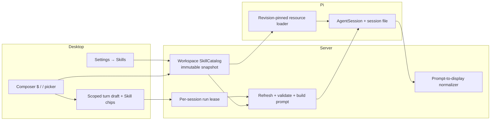

# Codex 风格 Skills 集成设计

日期：2026-07-18 · 状态：实施中

## 背景

Marginalia 当前使用 `@earendil-works/pi-coding-agent` 驱动 AgentSession，但运行时显式设置
`noSkills: true`，桌面端 Settings 中的 Skills 入口也处于禁用状态。Pi 依赖已经实现 Agent
Skills 的解析、校验、隐式提示和单个 `/skill:name` 展开；Marginalia 缺少统一的磁盘目录、
管理界面、多个显式 Skill 调用、发送前一致性校验和历史展示边界。

本设计保留 Pi 的 Skill 文件格式和加载语义，同时提供接近 Codex Desktop 的图形交互：用户
可以在 Composer 中通过 `$` 或 `/` 选择 Skills，在 Settings → Skills 查看磁盘上的候选、
诊断和启停状态。第一版只管理已经存在的本地 Skills，不负责创建、安装或修改它们。

## 目标

- 复用 Pi 对 Skill frontmatter、名称、描述、`disable-model-invocation` 和同名冲突的语义。
- 支持 Marginalia、Pi CLI 和通用 Agent Skills 的 workspace/global 磁盘目录。
- 通过 `$` 和 `/` 两个入口选择一个或多个显式 Skills，并保留选择顺序。
- 保留 Pi 的渐进披露：隐式调用只把已启用 Skill 的元数据放进 system prompt；显式调用才
  把完整 Skill 正文注入本轮 user message。
- 提供 Settings → Skills 的只读管理页，包括搜索、来源、路径、详情、诊断和启停。
- 在每次发送前重新扫描并验证显式选择；任何选择失效时阻止整轮发送且保留 Composer 状态。
- 保证实时消息与重开历史在 Skill 标记和 Marginalia 附件 envelope 上采用同一展示边界。
- 不修改 Pi CLI 或通用 Agent Skills 的文件和设置。

## 非目标

- 不提供 `/skills` 管理命令。
- 不创建、导入、安装、卸载、更新或编辑 Skills。
- 不提供 marketplace、plugins 或远程 Skill 源。
- 不增加持续文件 watcher；刷新只由明确的产品事件触发。
- 不修改 `@earendil-works/pi-coding-agent` 上游代码。
- 不在本期解决 MCP。
- 不在本期为每轮额外持久化原始展示消息和 Skill identities；历史以严格解析 Pi user message
  为主。
- Skills capability token 只保护本功能新增的敏感能力，不关闭整个 loopback API 的
  `P0-SEC-001`。

## 已确认方案

采用“workspace SkillCatalog + Pi 原生 runtime loader”的方案：

1. pi-server 为 global-only 上下文和每个 workspace 维护一个 `SkillCatalog`。
2. Catalog 按固定目录顺序发现候选，用 Pi 导出的加载函数解析和校验，并发布不可变快照。
3. Settings、Composer picker 和 run preflight 使用同一快照模型。
4. 每个 AgentSession 使用独立、revision-pinned 的 `DefaultResourceLoader`；loader 只接收该
   revision 的有效 Skills。
5. 显式选择由服务端按顺序拼成多个 Pi 原生 `<skill>` blocks；隐式调用继续由 Pi system
   prompt 驱动。
6. Pi session 文件保持原始、完整、可重放；历史 API 只在展示边界做归一化。



## 领域模型

### Skill candidate

Candidate 表示磁盘上被发现的一个 `SKILL.md` 或 Pi-mode 根级 Markdown 文件。它至少包含：

- `name`、`description`：Pi 成功解析时提供；解析失败时可以为空。
- `path`：用于向用户解释来源的发现路径。
- `canonicalPath`：最终 realpath；它是选择、去重和启停偏好的稳定身份。
- `baseDir`：canonical `SKILL.md` 的父目录，用于解析相对引用。
- `source`：固定来源枚举和 `workspace | user` scope。
- `enabled`：Marginalia 私有偏好；没有偏好记录时为 `true`。
- `effective`：是否为当前同名候选的实际胜者。
- `explicitOnly`：Pi frontmatter 的 `disable-model-invocation: true`。
- `explicitEligible`：是否满足显式调用的正文大小限制。
- `status`：`effective | shadowed | disabled | invalid`。
- `diagnostics`：Pi warning、collision 和 Marginalia 运行限制诊断。
- `shadowedBy`：shadowed 候选对应的胜者 canonical path。
- `bytesTotal`：本次刷新读取的原始 Skill 字节数。

Pi warning 不等于 invalid。非法 name 或过长 description 等 warning 在 Pi 返回 Skill 时仍允许
加载；只有缺少必需 description、读取失败或 Pi 没有返回 Skill 时才标记 `invalid`。Collision
单独表现为 `shadowed`。单一 `status` 的优先级固定为
`invalid > disabled > shadowed > effective`，而 `enabled` 保留为独立布尔值。因此一个被用户关闭
且解析失败的 candidate 显示 Invalid，同时 toggle 仍能反映其 disabled preference，不会因
关闭而隐藏真实诊断。

### Catalog snapshot

每次成功刷新发布一个不可变快照：

- `candidates`：所有被发现的候选，包括 disabled、shadowed 和 invalid。
- `effectiveSkills`：过滤 disabled/invalid 后按优先级由 Pi first-wins 得到的集合。
- `diagnostics`：目录、解析、冲突、大小和读取诊断。
- `catalogRevision`：候选、诊断、偏好或展示数据变化时改变，供 Settings/picker 防止旧响应覆盖。
- `effectiveRevision`：只有影响 Pi system prompt 或显式 Skill 内容的有效集合变化时改变。
- `refreshedAt`：刷新完成时间。

服务端快照还持有本轮实际读取的原始 bytes。列表 API 不返回这些 bytes；详情预览和显式 block
构建都使用同一份快照 bytes，不在发送校验后再次根据客户端 path 读盘。

## 磁盘发现与优先级

### 固定顺序

同名候选按以下顺序 first-wins：

| Priority | Source                           | Scope     | Discovery mode |
| -------- | -------------------------------- | --------- | -------------- |
| 1        | `<workspace>/.marginalia/skills` | workspace | Pi mode        |
| 2        | `<workspace>/.pi/skills`         | workspace | Pi mode        |
| 3        | ancestor `.agents/skills`        | workspace | Agents mode    |
| 4        | `~/.marginalia/skills`           | user      | Pi mode        |
| 5        | `~/.pi/agent/skills`             | user      | Pi mode        |
| 6        | `~/.agents/skills`               | user      | Agents mode    |

Pi mode 支持目录中的 Skill roots，以及 Pi 兼容的根级 Markdown Skill 文件。Agents mode 只按
Agent Skills 目录语义发现 `SKILL.md`，不把 `.agents/skills` 根目录下任意 Markdown 文件当作
Skill。每个 discovery root 内按规范化 POSIX relative path 做 Unicode code-point 升序排序；
source priority、ancestor 由近到远、relative path 三者共同组成完整且跨文件系统稳定的顺序。

Ancestor `.agents/skills` 从 workspace root 向上按由近到远枚举：存在 Git repository root 时
在该 root 停止，否则到文件系统 root。若其中某项 canonicalize 后等于 `~/.agents/skills`，从
workspace 组排除，确保全局通用目录只在 priority 6 出现一次。

`.marginalia` 和 `.pi` 只读取 workspace root 自身的目录，不向祖先查找。

### 稳定解析、禁用与 collision

Catalog 使用明确的两阶段 pipeline。

第一阶段按确定顺序发现 candidate descriptors 并 canonicalize，同一 realpath 只保留第一次
出现。每个 candidate 都必须独立解析，不因 disabled 或同名关系跳过：

1. 读取 canonical file 得到 bytes A 和 hash A。
2. 只用该单一 path 调用 Pi 导出的 `loadSkills({ skillPaths: [path], includeDefaults: false })`，
   获取 parsed Skill 和 diagnostics；单文件调用不会产生跨 candidate collision。
3. 再次解析 realpath 并读取 bytes B/hash B。
4. 只有 realpath 未改变且 hash A 等于 hash B 时，才把 Pi parsed result 与 bytes B 组合成
   candidate。解析发生在两次相同读取之间，因此 metadata、diagnostics 和保留正文属于同一个
   稳定文件版本。
5. 不一致时最多重试三次；仍不稳定则发布 `invalid` candidate 和 `unstable_file` diagnostic，
   不让一个持续变化的文件阻止其他 Skills 刷新。

第二阶段读取 Marginalia preferences，并按 status precedence 处理全部 parsed candidates：

- Pi 没有返回 Skill的 candidate 为 invalid，不参与 effective 集合，无论 enabled 值为何。
- Valid 但 disabled 的 candidate 为 disabled，在同名选择前排除。
- 对剩余 enabled + valid candidates 按完整顺序执行 Pi-compatible name first-wins：第一个为
  effective，后续同名项为 shadowed，并生成与 Pi collision 字段一致的 diagnostic。

该阶段直接使用第一阶段的 Pi-parsed Skill objects，不再次读盘。这样既保留 Pi 对每个 Skill 的
frontmatter/warning 语义，又避免 `skillsOverride` 在 Pi 已丢弃 loser 后删除 winner。禁用高优先级
胜者时，下一个 enabled + valid 同名候选会自动接替。

Settings 仍展示所有候选：被更高优先级覆盖但自身 enabled 的候选标记为 `shadowed`；关闭胜者
后刷新即可看到接替结果。Composer 已选择的旧 canonical path 不会静默改绑到接替者。

### Symlink

发现行为与 Pi 一致，允许目录或 `SKILL.md` symlink 指向来源 root 外部。Settings 同时展示
发现路径和 canonical path，明确实际内容位置。身份、偏好、去重和发送校验都使用最终 realpath。

如果 symlink 在刷新后被重新指向，当前不可变快照仍使用刷新时读取的 bytes；下一次刷新将它
视为新的 canonical identity。旧选择在 preflight 中失败，不会自动跟随到新目标。

## 刷新模型

第一版不启动 watcher。以下事件调用 Catalog refresh：

- 打开 Settings → Skills。
- 切换活动 workspace。
- 打开 `$` picker 或 `/` menu 中的 Skills 分区。
- 点击 Settings 的 Refresh。
- 每次发送前的服务端 preflight。

同一 workspace 的 refresh 串行执行并原子发布。较早 generation 晚完成时不得覆盖较新的
snapshot。Revision 输入包含确定顺序、canonical identity、Pi metadata/diagnostics、preference、
body hash 和运行限制，序列化后产生稳定 hash；相同磁盘状态不能因 readdir 顺序改变 revision。
Settings 和 picker 响应只有在 `workspaceId + requestId` 仍匹配当前 UI 状态时才落地；菜单项
保留生成它们的 catalog revision 供诊断，但服务端最新 preflight 永远是最终判定。

## Marginalia 私有启停状态

SQLite 增加真正的 version 2 migration：

```text
skill_preferences
  skill_path TEXT PRIMARY KEY
  enabled INTEGER NOT NULL CHECK (enabled IN (0, 1))
  updated_at INTEGER NOT NULL
```

`skill_path` 保存 canonical realpath。Preference 是全局按路径生效；`workspaceId` 只决定本次
Catalog 的目录上下文，不是 preference scope。没有记录时默认 enabled。文件消失时可以保留
偏好 tombstone；它不在 Settings 中显示，未来同一 canonical path 重新出现时继续应用。

Settings 只允许修改当前 snapshot 已发现的 candidate。任何启停操作都不写 `SKILL.md`、
`.pi/settings.json`、`.agents` 配置或 Pi CLI state。

## Skills capability token

pi-server 只监听 loopback。Task 1 已为所有 run 加入进程 capability 并停止反射任意 Origin，
但其他既有 route 仍未认证；新增 global Skill 枚举、预览和启停会把可读范围扩展到 workspace
外，因此 Skills 正常产品路径同样必须使用这项局部 capability：

1. Electron main 为每次 pi-server 进程生成高熵随机 token，并通过环境变量传入 child process。
2. `pi-server:status` 经 preload 把 URL 和 token 交给可信 renderer；token 不写入数据库或日志。
3. `ApiClient` 对 Skills API 和所有 run 请求发送 `Authorization: Bearer <token>`。所有 run 都
   可能通过 Pi system prompt 隐式使用 Skills，不能只保护显式 `skills` 非空的请求。
4. pi-server 对上述请求校验 token；缺失或不匹配返回 `401`，并对浏览器 Origin 使用明确的
   Electron packaged/dev allowlist，而不是反射任意 Origin。
5. 测试和显式开发入口通过注入 token 建立客户端；没有 token 时不能调用敏感 Skills 能力。

Origin/preflight 契约固定如下：

- Packaged renderer 从 `file:` 加载；实际请求允许 absent 或 `null` Origin，但仍必须通过 bearer
  token。`null` 本身不构成授权。
- Development 只允许 `VITE_DEV_SERVER_URL` 解析出的 exact origin，且 hostname 必须为
  `127.0.0.1`、`localhost` 或 `::1`；该值由 Electron main 通过 child environment 传给
  pi-server。
- CORS `OPTIONS` preflight 按 exact Origin allowlist 放行，并声明 `Authorization` 和
  `Content-Type`；preflight 不要求 bearer，实际请求必须校验。
- Server/test construction 显式注入 `allowedOrigins` 和 token，不从请求动态学习 Origin。

Capability token 不把客户端 canonical path 变成文件读取权限。服务端只用它在当前 snapshot
中做精确 membership lookup，后续读取和 prompt 构建使用 snapshot 自己的数据。

这一局部防护不改变其他现有 HTTP route 的认证状态，`P0-SEC-001` 继续保持 open。

## HTTP API

### `GET /skills?workspaceId=<optional>`

每次调用都刷新并返回 snapshot 的公开部分。省略 `workspaceId` 时只扫描三个 global roots；
提供无效 workspace ID 返回 `404`。响应不包含完整 Skill body。

主要响应字段：

```text
{
  catalogRevision,
  effectiveRevision,
  refreshedAt,
  workspaceId,
  candidates: SkillCandidate[],
  diagnostics: SkillDiagnostic[]
}
```

### `PATCH /skills/state`

请求：

```text
{ path: canonicalPath, enabled: boolean, workspaceId?: string }
```

服务端先刷新对应 Catalog，确认 path 是当前 candidate，再更新 `skill_preferences` 并返回新的
snapshot。未知、已消失或不属于该上下文的 path 返回 `404`。

### `GET /skills/content`

Query 为 `path` 和可选 `workspaceId`。服务端只接受当前 snapshot candidate 的 canonical
path，返回：

```text
{ path, content, truncated, bytesTotal }
```

预览最多返回 256 KiB UTF-8 内容；超出时 `truncated: true`。Invalid candidate 仍允许只读预览，
便于用户查看 frontmatter 和诊断。

### `POST /sessions/:sessionId/runs`

现有 body 增加可选字段：

```text
skills?: Array<{ name: string, path: string }>
```

省略时等价于空数组。Path 是结构化选择的 canonical identity，但只作为 snapshot membership
lookup key；服务端从不直接读取请求 path。服务端按 canonical path 去重并保留第一次出现的
顺序。Name 必须与 snapshot 中该 path 的当前 Pi name 一致。

## Per-session single-flight 与发送事务

Skills revision 切换依赖服务端 single-flight，不能只依赖 renderer 的 `sending` 状态。每个
session 在 server 端最多持有一个 run lease：

1. 请求首先原子取得 session lease；已被占用时返回 `409 session_busy`，不创建 run。
2. 在 lease 内刷新 Catalog、校验选择、准备 Skill bytes、构建完整 prompt。
3. 调用新的 `AgentClient.prepare(...)`，只解析 model/config、取得或重建 revision-pinned
   AgentSession handle，不开始 `prompt()`。若 `effectiveRevision` 改变，它在此阶段用原 pi
   session 文件和新的独立 loader 重建 handle。
4. Catalog、prompt 和 AgentSession preparation 全部成功后才调用 `createRun` 并进入 SSE。
5. SSE 先发 `run_started`，再调用 `PreparedAgentRun.start(message, promptOptions)` 开始 Pi prompt。
6. Run 完成、失败或 abort 后等待 execution 的 `settled` Promise；只有 Pi prompt 的 finally、
   pending approval 清理和事件流关闭全部结束后才释放 lease。

AgentClient 边界从当前“一次调用同时 acquire + prompt”拆为：

```text
AgentClient.prepare(configWithoutMessage) -> PreparedAgentRun

PreparedAgentRun
  sessionFile
  start(message, promptOptions) -> AgentRunExecution

AgentRunExecution
  events: AsyncIterable<AgentRunEvent>
  abort(): void
  settled: Promise<void>
```

SSE disconnect 只触发 `abort()`，不能直接释放 lease。Route 的 `finally` 必须等待 `settled` 后再
释放；这保证断开的旧 prompt 不会与随后取得 lease 的新 run 同时写同一 Pi session。若
`prepare` 或 `createRun` 前步骤失败，直接释放 lease且没有 run；`start` 后的错误属于真实 run，
按现有 run failure contract 记录。

显式选择的 preflight 规则：

- 每轮 request body 最多 4 MiB，在 JSON decode 前同时检查 declared 和实际 streamed bytes；capability
  auth 必须先于 body 读取。
- 每轮最多提交 16 个 raw Skill selections，在 canonical path 去重前检查；每个 selection 的 name/path
  分别最多 16 KiB UTF-8。
- 每个当前 Skill body 最多 512 KiB；超过时仍可作为 Pi warning candidate/隐式元数据存在，
  但 `explicitEligible: false`，不出现在 picker。
- 本轮展开后的全部 Skill blocks 最多 2 MiB。
- 每个 path 必须仍然存在于最新 snapshot，且 valid、enabled、effective、explicitEligible。
- Name 必须匹配；同路径重复项安静去重。
- Name、canonical path 或 baseDir 含 XML 1.0 不允许的控制字符时不可显式调用。

任一选择失败返回 `409 skill_precondition_failed`：

```text
{
  error: "skill_precondition_failed",
  catalogRevision,
  invalidSelections: [
    { name, path, reason, winnerPath? }
  ]
}
```

`reason` 为
`missing | disabled | invalid | shadowed | name_mismatch | too_large | unsupported_identifier`。
数量或总展开大小超限返回 `413 skill_payload_too_large`；总展开按 `blocks.join("\n\n")` 的实际 UTF-8
序列化计量，包含 block 间分隔符。这些错误全部发生在 `createRun` 前，
因此数据库不留下虚假的 run，`AgentClient.prepare` 之后也不会调用 `start`。

## Pi runtime 集成

### Runtime loader

Catalog 负责发现和解析；每个 AgentSession 获得自己的 `DefaultResourceLoader`：

- `noSkills: true`，避免 Pi 默认目录顺序和 Pi CLI settings 改写 Marginalia 已确认的顺序与
  私有启停状态。
- `skillsOverride` 返回创建该 loader 时固定的 effective `LoadSkillsResult`，不是在 Pi 完成
  collision 后临时过滤 disabled paths。
- 审批 extension 和当前关闭的 prompt/theme/context discovery 保持原有边界。

AgentSession handle 记录 `effectiveRevision`。Catalog 只有 diagnostics、disabled loser 或展示
字段变化而 effective 集合不变时，不重建 AgentSession。Effective metadata、path、显式正文或
顺序变化时，在持有 session lease 且 session 空闲的前提下重建。

Pi 构造 system prompt 时读取 effective Skills。`explicitOnly` Skills 继续由 Pi 的
`disable-model-invocation` 语义从隐式列表排除，但它们仍可通过 `$` 或 `/` 显式选择。

### 多个显式 Skill blocks

不把多个选择转换成 Pi 的单个 `/skill:name` 命令。服务端从同一 snapshot bytes strip
frontmatter，按用户选择顺序生成 Pi 原生格式。Block builder 对 `name` 和 `location` 使用标准
XML attribute escaping（`&amp;`、`&quot;`、`&lt;`、`&gt;`、`&apos;`），对 References 行中的
baseDir 使用 XML text escaping。History parser 使用完全匹配的 decoder 后再展示 `$name`；
客户端 name 始终与 decoded logical name 比较。XML 1.0 不允许的控制字符不做有损替换，直接使
candidate `explicitEligible: false` 并产生 `unsupported_identifier` diagnostic。

```xml
<skill name="brainstorming" location="/canonical/path/brainstorming/SKILL.md">
References are relative to /canonical/path/brainstorming.

...Skill body...
</skill>

<skill name="pdf" location="/canonical/path/pdf/SKILL.md">
References are relative to /canonical/path/pdf.

...Skill body...
</skill>

用户正文
```

Skill blocks 位于消息最前；用户正文随后；现有 `<attached_files>` envelope 最后追加。完整消息
构建成功后才能创建 run。Pi 把该 user message 原样保存到 session 文件，确保模型历史仍含
完整指令。

## Desktop 交互

### `$` 与 `/` picker

- 输入 `$` 打开 Skill 专用菜单。
- 输入 `/` 打开现有 Slash Menu；Commands 与 Skills 在视觉上分区，但键盘导航数据仍是只含
  可选择行的扁平数组。
- 不注册 `/skills` 管理命令。即使磁盘上存在名为 `skills` 的 Skill，也以 `$skills` 和
  “Skill” 类型标签展示，不产生管理语义。
- 两个入口使用同一 effective picker list；选择结果都是 `{ name, canonicalPath }`。
- 选中后移除 trigger token，在 Composer 上方增加 `$name` chip，不把伪 slash 文本写进
  textarea。
- 支持多个 chips，保持选择顺序；canonical path 重复时不新增。
- Picker refresh 失败时不允许从旧请求新增选择；已经存在的 chips 保留，最终仍由发送
  preflight 校验。

### Composer 状态所有权

Composer draft 不能只存在于组件本地，因为 ChatView 和 Settings 互斥挂载。Desktop store 增加
非磁盘持久化、按 owner 隔离的 turn draft：

```text
{ text, contextFiles, skills }
```

已存在 session 的 owner key 为 `sessionId`；New Thread 使用 workspace-scoped new-thread key。
切换 session/workspace 或进入 Settings 不得串用草稿。

New Thread 创建 session 时传递完整一次性 `pendingTurn`，而不是只传 `pendingPrompt` 字符串，
确保首轮 text、附件和有序 Skill identities 一起进入 ChatView。

### 接受、失败与 Retry

- `ApiClient` 保留 HTTP status、错误 code 和 `invalidSelections`，不把结构化 409 压扁成普通
  `Error(message)`。
- Desktop 收到 SSE `run_started` 后才追加 optimistic user entry，并清空对应 draft、附件和
  Skill chips。
- `session_busy` 或 Skill precondition 失败时不追加用户气泡，不进入普通 run Retry 流程。
- Skill precondition 失败标红对应 chips，保留正文、全部 chips 和附件，并提供 Refresh、移除
  chip、打开 Settings 三种修复入口。
- 打开 Settings 后返回依靠 scoped draft 恢复现场。
- `lastSent` 扩展为 `{ text, contextFiles, skills }`；只有已经收到 `run_started` 的失败 run 才
  可 Retry，并重新执行最新 preflight。

### Settings → Skills

Settings 启用现有 Skills tab。页面不提供新增或修改操作，包括：

- 搜索 name、description 和 path。
- 展示当前 workspace 名称；活动 workspace 必须从已加载 workspace 列表解析，stale ID 按
  global-only 处理。
- 没有 workspace 时只显示三个 global roots。
- 列表状态：Effective、Enabled · Shadowed、Disabled、Invalid；warning 与 explicit-only
  使用独立标记。
- 展示 source、发现路径和 canonical path。
- 选择行后按需读取只读 preview 和 diagnostics。
- Enabled toggle 与 Refresh；toggle 立即返回新的 snapshot。

## Pi session 历史展示

`readMessagesFromSessionFile` 当前把 Pi user message 原样返回。显式 Skill 调用后，Pi session
保存的是完整 `<skill>` blocks；带附件时还保存完整 `<attached_files>` 内容。实时 user bubble
却只展示用户输入，因此需要统一的 agent-prompt-to-user-display 归一化。

归一化仅处理 user message 的文本展示副本：

1. 严格识别消息开头连续、完整的 Pi `<skill name="..." location="...">` blocks，并解码 block
   builder 生成的五种 XML attribute entities。
2. 按顺序提取 decoded name，展示为 `$brainstorming $pdf` 等用户标记。
3. 严格识别消息末尾由 Marginalia 生成的完整 `<attached_files>` envelope，并从展示正文中移除
   内联文件内容；本期不在已发送 user bubble 重建附件卡。
4. 保留中间用户正文。
5. 不查询当前 Catalog，因此 Skill 后来删除后仍能根据历史 block 属性显示 name。
6. 不改写 Pi session 文件，不改变再次发送给模型的历史。

解析按区域 fail-closed：疑似 Skill 前缀不完整时保留整个原消息；附件 suffix 不完整时不剥离
该 suffix。Pi block 使用文本 closing tag，没有长度前缀，任意 Markdown body 理论上可以包含
相同 `</skill>` 序列。V1 接受该已知限制；极端内容无法可靠区分时展示原始 prompt。若未来要求
绝对无歧义，单独设计 turn display metadata 持久化，不能在本期暗中增加第二套历史事实源。

## 错误处理

| Condition                            | HTTP / UI behavior                                      |
| ------------------------------------ | ------------------------------------------------------- |
| Skills token 缺失或错误              | `401`；不返回目录、path、内容或状态                     |
| Origin 不在允许范围                  | `403`；不执行 Skills 操作                               |
| Workspace 不存在                     | `404`；Settings 回退 global-only 或提示刷新 workspace   |
| Preview/toggle path 不在当前 Catalog | `404`；不得直接读客户端 path                            |
| 同 session 已有 run                  | `409 session_busy`；不刷新 handle、不创建 run           |
| 已选 Skill 失效                      | `409 skill_precondition_failed`；保留完整 Composer 状态 |
| 数量或总展开内容超限                 | `413 skill_payload_too_large`；保留完整 Composer 状态   |
| Run pre-create 非 typed 内部失败     | `500 run_preparation_failed`；不返回异常/path/bytes     |
| 单目录/单文件读取失败                | 作为 candidate/catalog diagnostic；其余 Skills 继续可用 |
| Catalog 整体无法建立                 | `500`；picker 不允许新增选择，Settings 展示可重试错误   |
| 历史 envelope 无法严格解析           | Fail closed，原样展示对应文本，不改 session             |

## 资源与隔离边界

- Run request 最多 4 MiB；最多 16 个 raw 显式 selections；每个 selection name/path 最多 16 KiB
  UTF-8；单项 block 512 KiB、含分隔符的实际序列化总展开 2 MiB、preview 256 KiB。
- Catalog refresh 按 workspace 串行；snapshot 发布后不可变。
- AgentSession 不共享可变 loader 实例；Settings refresh 不会在运行中热改资源。
- Global-only 与各 workspace Catalog 分开缓存，workspace key 使用 canonical workspace root。
- 同一 realpath 的 symlink alias 只加载一次。
- Capability token 不落数据库、不输出日志。Snapshot 对 explicit-eligible Skill 保留最多
  512 KiB 完整 bytes；对超限或 invalid candidate 只保留 256 KiB preview prefix 和总字节数。
  完整显式正文最终进入 Pi session 的正常历史。

## 测试策略

### pi-server

- Discovery：六级顺序、Pi/Agents 两种 mode、ancestor 由近到远、Git root 停止、排除 global
  `~/.agents/skills` 重复项。
- Candidate：valid、warning、invalid、explicit-only、collision、disabled winner 接替、同一
  realpath alias 去重。
- Snapshot：catalog/effective revision 稳定性、refresh generation 防旧结果覆盖、bytes 与
  preview/run 共用、symlink retarget 后旧选择失效。
- Persistence：v1 数据库升级到 v2、enabled check、canonical path、stale tombstone。
- Security：缺失/错误 token、Origin、任意 path、非 Catalog path、workspace 交叉 path。
- Run：同 session 重叠请求 409、active run 不替换 handle、revision 变化后空闲重建、0/1/N
  Skills、顺序、canonical 去重、name mismatch、disabled/invalid/shadowed/missing/too-large。
- Transaction：所有 precondition、稳定读取和 `AgentClient.prepare` 错误后 `runs` 数量不变；
  `createRun` 后才允许 `start`。SSE disconnect 必须 abort 并等待 settled 后释放 lease。
- Pi integration：effective Skills 出现在隐式 system prompt；explicit-only 只允许显式；多个原生
  blocks 的完整正文、顺序、attribute escaping 和 history decoding 正确。
- History：0/1/N blocks、Skill 后删除、正常/异常附件 suffix、malformed fail-closed、原 session
  文件未被修改。

### Desktop

- `$` picker、Slash Menu Skills 分区、键盘导航、搜索和空状态。
- 多 chips 顺序、canonical 去重、移除和 warning UI。
- New Thread `pendingTurn` 保留 text/contextFiles/skills。
- Draft 按 session/new-workspace 隔离，Settings 往返恢复。
- 只有 `run_started` 清空并追加 user bubble；typed 401/409/413 保留状态。
- `invalidSelections` 精确标红；Refresh、移除、打开 Settings 修复。
- Retry 携带已接受 turn 的完整 Skills，不重试 precondition failure。
- Settings global-only、workspace 合并视图、搜索、详情、warning/invalid/shadowed/disabled/
  explicit-only、toggle 和 refresh。
- Picker 异步请求在 workspace/requestId 变化后不能覆盖当前状态。

### Repository gates

实现任务遵循测试先行。开发中运行 touched package focused tests、typecheck 和 build；交付前运行
`pnpm verify`。UI 变化运行 `pnpm verify:visual`，逐张检查 Settings、`$` picker、Slash Menu、
多 chips、global-only、diagnostics 和 precondition blocked 状态；只为确认的视觉变化更新 baseline。

## 正式文档与治理

实现 Skills 正常产品路径时，同步更新：

- `docs/user/guide.md`：选择、管理、刷新、阻止发送和已知限制。
- `docs/user/concepts.md`：Skill 从 disabled 改为可用概念。
- `docs/user/configuration.md`：六级目录、优先级、SQLite preference、capability 和大小限制。
- `docs/developer/api.md`：新增 route、run body、错误、migration 和 route inventory。
- `docs/developer/architecture.md`：Catalog、single-flight、loader revision 和历史归一化。
- `docs/product/status.md`：`CAP-SKILLS-001` 改为 `partial`；`P1-EXTENSIONS-001` 继续 open，因为
  MCP 仍 disabled。
- `docs/contracts/docs-impact.json`：让新增 server/desktop Skills 模块命中 user、developer 和
  product status 文档，不只匹配现有两个入口文件。

## 验收标准

- 用户可以从 `$` 或 `/` 选择一个或多个有效 Skills，看到有序 chips，并成功显式调用。
- Pi system prompt 只包含当前 effective 且允许 model invocation 的 Skills。
- Settings 能解释每个磁盘候选来自哪里、为何 effective/shadowed/disabled/invalid，并只修改
  Marginalia 私有 preference。
- 禁用同名胜者后，下一 enabled 候选自动接替；旧 chip 不自动改绑。
- 发送前任何 Skill 变化都以结构化错误阻止整轮，草稿、附件和 chips 不丢失，且无 run 记录。
- New Thread 首轮、Retry、Settings 往返和 session/workspace 切换不丢失或串用 Skill 状态。
- 同 session 重叠 run 被服务端拒绝，active AgentSession 不因 revision 变化被替换。
- Preview 和显式 prompt 使用同一 snapshot bytes，客户端 path 不能读取任意文件。
- 重开历史显示 `$skill` 标记而不是完整 Skill body；Pi session 本身保持完整。
- Skills 敏感接口和所有 run 必须通过 capability token；整体 loopback P0 仍被准确记录。
- 自动测试、`pnpm verify` 和视觉差异裁决全部完成，正式文档与产品状态同步。

## 已排除方案

### 直接使用 `/skill:name`

Pi 原生命令一次只展开一个 leading Skill，无法表达本设计要求的多 Skill 顺序和基于 canonical
path 的精确身份；同名接替时也容易把旧选择静默解析为另一文件。

### 自写 Skill frontmatter/parser 和 system prompt

完全绕开 Pi 会复制验证、warning、collision、explicit-only 和 prompt 格式，升级时容易漂移。
Catalog 只补 Pi 没有公开覆盖的目录顺序、私有偏好和 UI candidate 视图，解析与有效集合仍交给
Pi 导出能力。

### 持续 watcher

V1 的明确刷新点和发送前 preflight 已保证正确性。Watcher 会增加跨平台文件事件、symlink、
debounce 和生命周期复杂度，不是当前目标所需。

### 为展示另建第二套 turn history

它可以完全消除文本 block 歧义，但会引入 Pi session 与数据库 turn metadata 的关联和同步问题。
V1 使用严格、fail-closed 的展示归一化；若真实 Skill 内容触发该限制，再为持久化映射单独设计。

## Deviation

Task 9 deep security review 确认两项必须收紧的边界，已由 repository maintainer 批准：

1. Pi 0.75.5 默认会把 leading `/skill:name` 按 loader `filePath` 重读磁盘。这会绕过 Marginalia 的
   immutable snapshot body、XML control 和 payload limits。`PreparedAgentRun.start()` 因此在合并
   caller prompt options 后强制 `expandPromptTemplates: false`；原生命令和 file prompt template 都不
   再展开，显式 Skill 只能通过本设计的 preflight blocks 调用。
2. 原设计只限制去重后的 selections 和展开 blocks，仍允许 raw duplicates、超长 identity fields 或
   大 JSON body 消耗解析资源。Run route 现在在 capability auth 后、JSON decode 前以 streaming cap
   限制 4 MiB body，并在去重前限制 16 个 raw selections 与每个 name/path 16 KiB UTF-8。

这些变更不改变 canonical first-path dedupe、exact membership、512 KiB block 或 2 MiB expanded total
语义。后续任何目录规则、API、持久化、认证、历史展示或大小限制变化，仍必须先更新本节并重新确认
相应正式文档。
