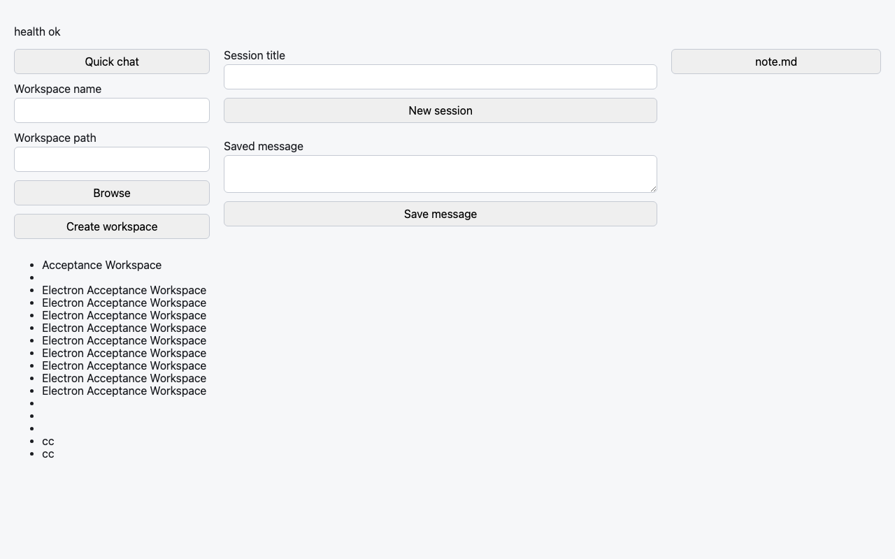
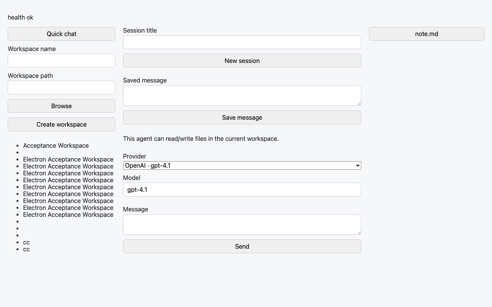
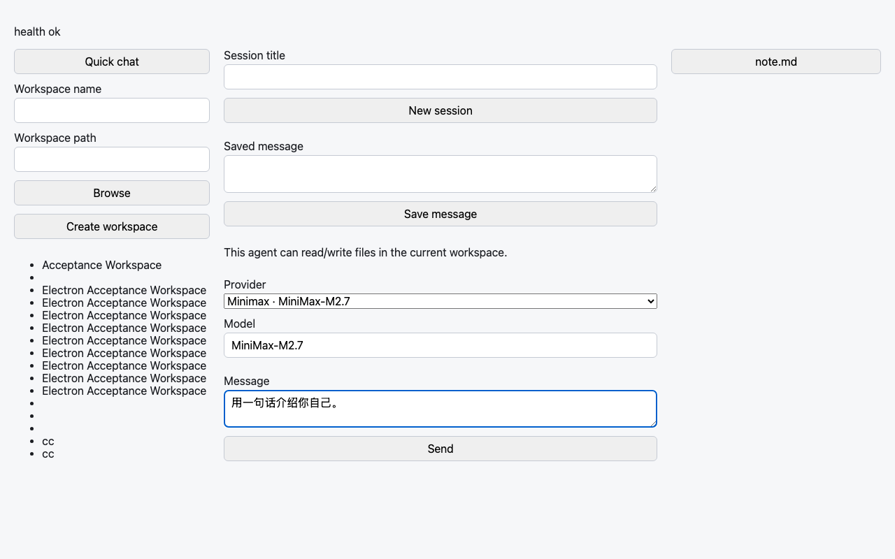
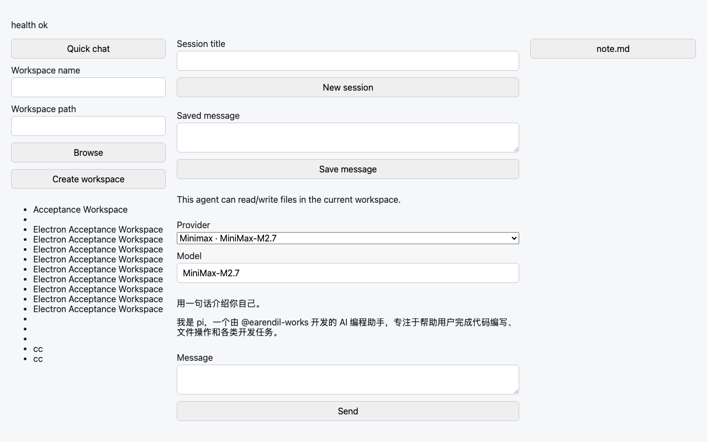
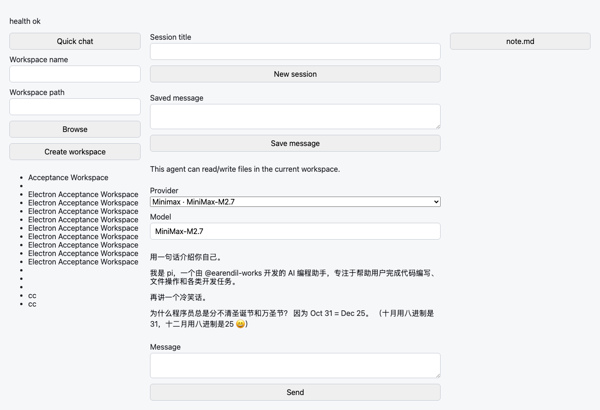

# verify-minimax 2026-05-26

- pi-server port: 62307
- session id: b790bdbd-a06d-4de5-bc8c-e2f523e619b8
- workspace: Acceptance Workspace (/tmp/marginalia-acceptance-workspace)
- provider: Minimax (MiniMax-M2.7)

## Turn 1: 用一句话介绍你自己。

```


我是一名 AI 编程助手，擅长读取代码文件、执行命令、编写和修改代码，帮助你完成各种开发任务。
```

## Turn 2: 再讲一个冷笑话。

```


为什么程序员总是分不清万圣节和圣诞节？

因为 **Oct 31 = Dec 25**（10月31日 = 12月25日）🎃🎄
```

Total events captured: 36

## Screenshots

Captured by `scripts/verify-minimax-screenshots.mjs` (Vite dev + headless Chromium driving the React frontend against the live pi-server with the Minimax provider).

-  — initial app load (health ok)
-  — ChatView mounted, empty session
-  — first message typed, provider = Minimax · MiniMax-M2.7
-  — first assistant response rendered
-  — both replies visible after second turn
-  — final state of the two-turn conversation

Companion artifacts in this folder:
- `turn1-events.json` / `turn2-events.json` — raw SSE envelopes from the HTTP-only smoke run
- `messages.json` — final `/sessions/:id/messages` response, sourced from the pi session JSONL file
